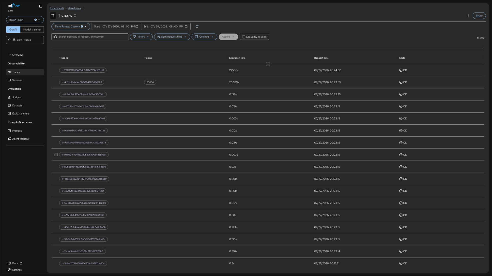

# Collecting Claw traces in MLflow

This guide shows how to send OpenTelemetry traces from Claw instances to the MLflow tracking server that ships with Red Hat OpenShift AI (RHOAI), using a per-namespace OpenTelemetry Collector. Every command and manifest in this guide was verified against the octo-claws cluster (RHOAI 3.4.2, MLflow 3.10.1, OpenTelemetry Operator 0.152.0).

## Architecture

```
Claw gateway pod (your namespace)
    | OTLP/HTTP (4318)
    v
OpenTelemetryCollector "otel" (your namespace)
    | otlphttp exporter: OTLP protobuf + workspace/experiment headers + SA bearer token
    v
MLflow tracking server (redhat-ods-applications)
    -> traces appear under your experiment, in the workspace named after your namespace
```

Key facts that shape the setup:

- MLflow's OTLP ingest endpoint accepts **OTLP/HTTP protobuf only** (no gRPC, no JSON), at `POST /v1/traces` on the **server root**. It is not under the `/mlflow` UI static prefix; `POST /mlflow/v1/traces` returns 404.
- Every export request must carry two headers: `X-Mlflow-Experiment-Id` (the numeric ID of an existing experiment) and `X-MLFLOW-WORKSPACE` (the workspace name). In the RHOAI deployment, MLflow workspaces map 1:1 to Kubernetes namespaces.
- Authentication is a Kubernetes bearer token. Authorization is a SelfSubjectAccessReview performed as the caller: the collector's ServiceAccount needs `update` on `experiments.mlflow.kubeflow.org` in the workspace namespace, with the experiment name as the resource name. Plain namespace-scoped RBAC, no cluster roles.

## Prerequisites

- The RHOAI operator installed, with the MLflow component enabled in the `DataScienceCluster` and an `MLflow` instance deployed (see [How MLflow is installed](#how-mlflow-is-installed-via-rhoai) below; already done on octo-claws).
- The Red Hat build of OpenTelemetry operator installed (already installed cluster-wide on octo-claws).
- A namespace with Claw instances managed by claw-operator, and permission to create ServiceAccounts, Roles, and OpenTelemetryCollectors in it.

Throughout this guide `$NS` is your Claw namespace; set it before running the commands.

```sh
export NS=<your-claw-namespace>
export MLFLOW_URL=https://rh-ai.apps.claws.bxz4.p1.openshiftapps.com/mlflow
```

## How MLflow is installed via RHOAI

For reference, and for clusters where this is not yet done. MLflow is a component of the RHOAI operator (`rhods-operator` >= 3.x): setting `mlflowoperator: Managed` in the `DataScienceCluster` deploys the MLflow operator, and an `MLflow` custom resource deploys the tracking server.

```yaml
# In the DataScienceCluster (cluster-scoped, name: default-dsc)
spec:
  components:
    mlflowoperator:
      managementState: Managed
```

```yaml
# The MLflow instance on octo-claws (namespace: redhat-ods-applications)
apiVersion: mlflow.opendatahub.io/v1
kind: MLflow
metadata:
  name: mlflow
spec:
  artifactsDestination: file:///mlflow/artifacts
  backendStoreUri: sqlite:////mlflow/mlflow.db
  serveArtifacts: true
  storage:
    accessModes: [ReadWriteOnce]
    resources:
      requests:
        storage: 50Gi
```

The operator deploys MLflow with `--app-name=kubernetes-auth` (bearer token authentication + SelfSubjectAccessReview authorization) and `--enable-workspaces --workspace-store-uri=kubernetes://` (each Kubernetes namespace is an MLflow workspace). The UI lives at `$MLFLOW_URL` and the in-cluster service is `https://mlflow.redhat-ods-applications.svc:8443`.

> **Note:** the current instance uses a sqlite backend store on a single PVC. MLflow serializes span writes on sqlite, so heavy trace volume from many Claws will bottleneck. For production-grade collection the `MLflow` CR should be moved to PostgreSQL and S3-compatible artifact storage; that is tracked as follow-up work.

## Step 1: create an experiment in your workspace

Traces must land in an existing experiment. Create one in your namespace's workspace via the REST API (any user with experiment-create permission in the namespace works; `oc whoami -t` uses your own token):

```sh
TOKEN=$(oc whoami -t)
curl -sk -X POST "$MLFLOW_URL/api/2.0/mlflow/experiments/create" \
  -H "Authorization: Bearer $TOKEN" \
  -H "X-MLFLOW-WORKSPACE: $NS" \
  -H "Content-Type: application/json" \
  -d '{"name": "claw-traces"}'
# {"experiment_id": "3"}
```

Record the returned `experiment_id`; the collector configuration needs it. You can also create the experiment from the MLflow UI after selecting the workspace matching your namespace.

## Step 2: RBAC for the collector

The OpenTelemetry operator creates a ServiceAccount named `<collector-name>-collector` (here: `otel-collector`). Grant it the MLflow permissions in your namespace:

```sh
cat <<EOF | oc apply -f -
apiVersion: rbac.authorization.k8s.io/v1
kind: Role
metadata:
  name: mlflow-trace-writer
  namespace: $NS
rules:
# OTLP ingest authorization: update on the target experiment by name
- apiGroups: ["mlflow.kubeflow.org"]
  resources: ["experiments"]
  resourceNames: ["claw-traces"]
  verbs: ["get", "update"]
# Workspace access check performs an un-named SelfSubjectAccessReview
- apiGroups: ["mlflow.kubeflow.org"]
  resources: ["experiments"]
  verbs: ["get"]
---
apiVersion: rbac.authorization.k8s.io/v1
kind: RoleBinding
metadata:
  name: mlflow-trace-writer-otel-collector
  namespace: $NS
subjects:
- kind: ServiceAccount
  name: otel-collector
  namespace: $NS
roleRef:
  kind: Role
  name: mlflow-trace-writer
  apiGroup: rbac.authorization.k8s.io
EOF
```

## Step 3: deploy the collector

The collector receives OTLP from the Claw gateway on 4318 and forwards traces to MLflow. TLS to MLflow is verified against the OpenShift service CA (the `openshift-service-ca.crt` ConfigMap is auto-injected into every namespace). Replace the `X-Mlflow-Experiment-Id` value with your experiment ID from step 1.

```sh
cat <<EOF | oc apply -f -
apiVersion: opentelemetry.io/v1beta1
kind: OpenTelemetryCollector
metadata:
  name: otel
  namespace: $NS
spec:
  mode: deployment
  volumes:
  - name: openshift-service-ca
    configMap:
      name: openshift-service-ca.crt
  volumeMounts:
  - name: openshift-service-ca
    mountPath: /etc/openshift-ca
    readOnly: true
  config:
    extensions:
      bearertokenauth:
        filename: /var/run/secrets/kubernetes.io/serviceaccount/token
    receivers:
      otlp:
        protocols:
          http:
            endpoint: 0.0.0.0:4318
          grpc:
            endpoint: 0.0.0.0:4317
    processors:
      memory_limiter:
        check_interval: 1s
        limit_percentage: 75
        spike_limit_percentage: 15
      batch:
        send_batch_size: 10000
        timeout: 10s
    exporters:
      otlphttp/mlflow:
        # MLflow requires OTLP/HTTP protobuf, which is this exporter's default encoding.
        # The OTLP route is at the server root, NOT under the /mlflow static prefix.
        traces_endpoint: https://mlflow.redhat-ods-applications.svc:8443/v1/traces
        headers:
          X-Mlflow-Experiment-Id: "3"
          X-MLFLOW-WORKSPACE: $NS
        auth:
          authenticator: bearertokenauth
        tls:
          ca_file: /etc/openshift-ca/service-ca.crt
      debug:
        verbosity: normal
    service:
      extensions: [bearertokenauth]
      pipelines:
        traces:
          receivers: [otlp]
          processors: [memory_limiter, batch]
          exporters: [otlphttp/mlflow, debug]
EOF

oc get pods -n $NS -l app.kubernetes.io/component=opentelemetry-collector
# otel-collector-<hash>   1/1   Running
```

This collector can coexist with the Tempo/Loki pipeline from the [claw-operator observability guide](https://github.com/redhat-et/claw-operator/blob/main/docs/observability.md); to run both, add `otlphttp/mlflow` as an additional exporter in that guide's traces pipeline instead of deploying a second collector.

## Step 4: enable trace collection on a Claw

Point the Claw's `spec.traces` at the collector service. The claw-operator injects the `OTEL_*` environment variables and `diagnostics.otel` config into the gateway; no sidecar is added.

```yaml
apiVersion: claw.sandbox.redhat.com/v1alpha1
kind: Claw
metadata:
  name: my-claw
  namespace: <your-claw-namespace>
spec:
  # The diagnostics-otel plugin pulled in by spec.traces requires OpenClaw >= 2026.7.1.
  # Pin the image (or spec.version) if your default is older; on 2026.6.10 the
  # init-plugins container fails with "requires plugin API >=2026.7.1".
  image: ghcr.io/openclaw/openclaw:2026.7.1
  # ... credentials, config ...
  traces:
    enabled: true
    endpoint: http://otel-collector.<your-claw-namespace>.svc:4318
    samplingRatio: "1"   # 0.0-1.0; use e.g. "0.1" to sample 10% in high-traffic setups
```

## Step 5: verify

Generate some traffic (send the Claw a few chat messages), then check each hop:

```sh
# 1. Gateway has OTLP configured
oc get deployment my-claw -n $NS -o jsonpath='{.spec.template.spec.containers[0].env}' | grep -o 'OTEL_EXPORTER_OTLP_ENDPOINT[^}]*'

# 2. Collector received and exported spans (debug exporter prints span counts;
#    no "Exporting failed" lines should follow them)
oc logs -n $NS deploy/otel-collector --since=5m | grep -E "Traces|Exporting failed"

# 3. Traces are in MLflow
TOKEN=$(oc whoami -t)
curl -sk -X POST "$MLFLOW_URL/api/3.0/mlflow/traces/search" \
  -H "Authorization: Bearer $TOKEN" \
  -H "X-MLFLOW-WORKSPACE: $NS" \
  -H "Content-Type: application/json" \
  -d '{"locations":[{"type":"MLFLOW_EXPERIMENT","mlflow_experiment":{"experiment_id":"3"}}],"max_results":10}'
```

In the MLflow UI, open the workspace named after your namespace, then the `claw-traces` experiment, then the **Traces** tab.

### What the traces look like

The OpenClaw diagnostics-otel plugin (2026.7.1) emits MLflow-aware spans, so traces render as first-class GenAI traces in the MLflow UI, not as generic OTel spans. Verified on the test instance:

- **Gateway startup** produces a burst of short `openclaw.diagnostic.phase` traces (one per boot phase: `gateway.ready`, `sidecars.model-prewarm`, etc.) with CPU timing attributes.
- **Each agent turn** produces a multi-span trace: an `openclaw.harness.run` root, with `openclaw.run`, `openclaw.model.call`, and `openclaw.tool.execution` children. The model call span carries `mlflow.spanType: CHAT_MODEL`, `mlflow.llm.model`, `mlflow.llm.provider`, and the standard `gen_ai.*` attributes; tool spans carry `mlflow.spanType: TOOL` and `gen_ai.tool.name`.
- **Token usage** arrives as a separate `openclaw.model.usage` trace per turn, with `openclaw.tokens.input/output/cache_read/cache_write/total` and the agent, channel, provider, and model as attributes. The UI's Tokens column picks these up automatically.



## Troubleshooting

All failures show up in the collector logs (`oc logs -n $NS deploy/otel-collector`). The exporter treats 4xx responses as permanent errors and drops the batch (`Exporting failed. Dropping data.`), so a misconfiguration silently loses spans; these are the responses behind the status codes:

| Status | MLflow error message | Cause |
| --- | --- | --- |
| 404 | `Endpoint not found.` | Wrong path. Use `/v1/traces` at the server root, not `/mlflow/v1/traces`. |
| 400 | `Workspace context is required for this request.` | Missing `X-MLFLOW-WORKSPACE` header. |
| 400 | `Missing required header: X-Mlflow-Experiment-Id` | Missing experiment header. |
| 400 | `Invalid Content-Type ... Expected: application/x-protobuf` | Exporter sending JSON; use the default protobuf encoding of `otlphttp`. |
| 403 | `Permission denied for requested operation.` | Collector SA lacks the Role from step 2, or the experiment name in `resourceNames` does not match. |
| 401 | authentication error | Bearer token missing/invalid; check the `bearertokenauth` extension is in `service.extensions` and referenced by the exporter. |

Two more things worth knowing:

- The experiment must exist before spans arrive; MLflow does not auto-create it from the header.
- If you recreate the experiment it gets a new numeric ID, and the collector's static header must be updated to match.

If the Claw gateway pod itself is stuck in `Init:Error`, check the `init-plugins` container logs: `Plugin "@openclaw/diagnostics-otel" requires plugin API >=2026.7.1` means the OpenClaw image is too old for the traces feature (see step 4).

## Limitations

- **Traces only.** MLflow has no OTLP ingest for logs or metrics. Keep logs/metrics pointed at the Tempo/Loki/Prometheus stack from the claw-operator observability guide; both pipelines can share one collector.
- **One experiment per collector pipeline.** The experiment and workspace are static exporter headers, so all Claws in the namespace land in the same experiment. Distinguish instances by the `service.instance.id` resource attribute (the gateway pod name). Separate experiments require separate exporters or collectors.
- **Sqlite backend.** See the note in the install section; fine for evaluation, a write bottleneck at scale.
